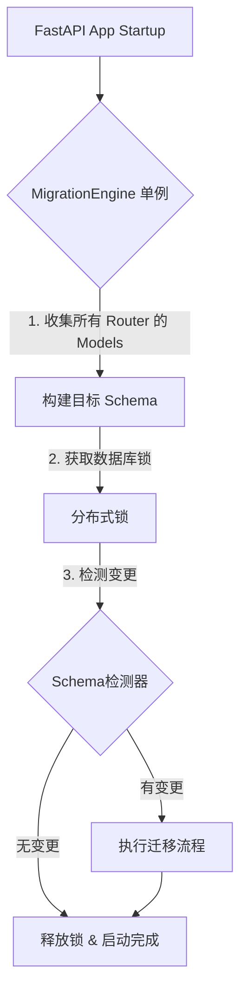

# FastAPI-Easy 智能迁移引擎：终极设计方案 v2.1

**版本**: 2.1 (迭代优化版)  
**目标**: 一步到位，零配置，生产级安全，**完美适配现有架构**  
**状态**: 🚀 待实施

---

## 1. 核心理念：一步到位 (One-Step)

我们不再追求"先验证后迁移"的过渡方案，而是直接构建一个**全自动、智能化、甚至比 Alembic 更易用**的内置迁移引擎。

### 三大原则
1.  **零认知负担 (Zero Cognitive Load)**: 开发者不需要知道什么是 Alembic，不需要运行 `alembic revision`，不需要配置 `env.py`。启动即就绪。
2.  **生产级安全 (Production Safety)**: 自动区分"安全变更"和"风险变更"。风险变更必须人工确认，且自动备份。
3.  **全生命周期管理 (Lifecycle Management)**: 不仅管 Schema (DDL)，也管数据 (DML)，还管回滚和历史。

---

## 2. 架构设计与项目集成

### 2.1 集成点分析
目前的 `fastapi-easy` 使用 `CRUDRouter` 来定义资源。如果在 `CRUDRouter` 初始化时进行迁移检测，会导致以下问题：
*   **重复检测**: 多个 Router 可能共享同一个 `Base.metadata`，导致重复扫描数据库。
*   **启动阻塞**: 也就是 N 个 Router 就要做 N 次检测，严重拖慢启动速度。

### 2.2 改进架构：生命周期挂钩 (Lifespan Hook)

我们将迁移引擎提升为 **Application Level** 的单例服务，而不是绑定在 Router 上。



**代码体验**:
```python
# main.py
from fastapi import FastAPI
from fastapi_easy import FastAPI_Easy, CRUDRouter

app = FastAPI()

# 初始化引擎，自动挂载 lifespan
# 这一步会自动收集所有注册的 CRUDRouter 信息
FastAPI_Easy.init_app(app, database_url="sqlite:///db.sqlite")

# 定义路由
router = CRUDRouter(model=User)
app.include_router(router)
```

---

## 3. 深度风险分析与解决方案 (Deep Dive)

### 3.1 SQLite 的特殊性 (The SQLite Challenge)
*   **问题**: SQLite 的 `ALTER TABLE` 支持极其有限（不支持删除列、修改列类型）。
*   **现有方案缺陷**: 之前的设计依赖 `ALTER`，在 SQLite 上会直接报错。
*   **解决方案**: **Copy-Swap-Drop 策略**。
    1.  创建新表 `users_new` (包含新 Schema)。
    2.  将旧表数据复制到新表: `INSERT INTO users_new SELECT ... FROM users`。
    3.  删除旧表 `users`。
    4.  重命名新表 `users_new` -> `users`。
    *   *注意*: 需要处理外键约束和索引重建。

### 3.2 分布式锁的异构实现 (Heterogeneous Locking)
*   **问题**: 不同数据库的锁机制完全不同。
*   **解决方案**: 抽象 `LockProvider` 接口。
    *   **PostgreSQL**: 使用 `pg_advisory_lock` (最稳健)。
    *   **MySQL**: 使用 `GET_LOCK`。
    *   **SQLite**: 使用文件锁 (`fcntl` 或 `.lock` 文件)，因为 SQLite 通常是单机文件访问。

### 3.3 权限问题 (Permission Denied)
*   **问题**: 在某些严格的生产环境，应用账号可能只有 DML 权限 (CRUD)，没有 DDL 权限 (ALTER/DROP)。
*   **解决方案**: **Dry-Run 模式 + SQL 导出**。
    *   如果捕获到 `PermissionError` 或配置为 `dry-run`，引擎不执行迁移，而是将生成的 SQL 打印到日志或保存为 `migration_plan.sql` 文件，供 DBA 执行。

### 3.4 数据迁移钩子体验 (Hook UX)
*   **问题**: 如何让用户写数据迁移脚本既简单又不破坏代码结构？
*   **解决方案**: **基于装饰器的注册机制**。

```python
from fastapi_easy import migration

# 定义在模型文件附近，或者单独的 migrations.py
@migration.hook(version="v2_split_name", trigger="before_ddl")
async def split_name_data(connection):
    # 使用原生 SQL 或 SQLAlchemy Core
    await connection.execute("UPDATE users SET first_name = ...")
```

---

## 4. 实施路线图 (Updated TODO List)

### 第一阶段：核心引擎与 SQLite 适配 (基础建设)
- [ ] **重构初始化逻辑**: 创建 `FastAPI_Easy` 入口类，管理全局配置和生命周期。
- [ ] **实现 Schema 检测器**:
    - [ ] 基础对比 (表/列存在性)。
    - [ ] **SQLite 特殊处理**: 识别 SQLite 环境，调整检测逻辑（SQLite 类型系统较弱）。
- [ ] **实现 SQL 生成器**:
    - [ ] PG/MySQL: 标准 DDL。
    - [ ] **SQLite**: 实现 `Copy-Swap-Drop` 生成逻辑。

### 第二阶段：智能与安全 (核心差异化)
- [ ] **实现风险评估引擎**:
    - [ ] 建立风险规则库 (例如: SQLite 修改列 = High Risk)。
- [ ] **实现锁机制**:
    - [ ] `PostgresLockProvider`
    - [ ] `MySQLLockProvider`
    - [ ] `FileLockProvider` (for SQLite)
- [ ] **实现 Schema 哈希缓存**: 必须支持 Redis 或本地文件缓存（针对无 DB 写权限场景）。

### 第三阶段：高级特性 (一步到位)
- [ ] **实现 Hook 系统**: 装饰器注册、执行顺序控制。
- [ ] **实现 CLI 工具链**:
    - [ ] `fastapi-easy migrate plan`: 仅生成 SQL 不执行。
    - [ ] `fastapi-easy migrate apply`: 执行。

### 第四阶段：集成与测试
- [ ] **编写 E2E 测试**:
    - [ ] SQLite 复杂迁移测试 (改列名+改类型)。
    - [ ] 并发启动测试 (使用多进程模拟)。
- [ ] **文档**: "从零开始" 指南，强调 SQLite 的无缝体验。

---

## 5. 潜在问题与应对 (Risk Mitigation)

| 潜在问题 | 风险等级 | 应对策略 |
| :--- | :--- | :--- |
| **大表 Copy-Swap 导致磁盘爆满** | High | 在执行 Copy-Swap 前检查磁盘空间；提供分批次 Copy 选项。 |
| **迁移过程中进程崩溃** | High | 事务保护；对于不支持 DDL 事务的 DB (MySQL)，记录详细的 Checkpoint，重启后提示人工介入。 |
| **复杂的自定义类型 (JSON/Array)** | Medium | 默认视为 String 处理；提供 `TypeComparator` 接口供用户扩展。 |
| **外键约束地狱** | Medium | 在 Copy-Swap 策略中，必须先禁用外键检查 (`PRAGMA foreign_keys=OFF`)，完成后再开启并验证。 |

---

## 6. 结论

v2.1 方案相比 v2.0，更加务实地解决了 **SQLite 兼容性** 和 **项目集成架构** 问题。这是 `fastapi-easy` 真正能够 "Easy" 地落地的关键。我们不仅是在做一个迁移工具，而是在做一个 **智能数据库管家**。
